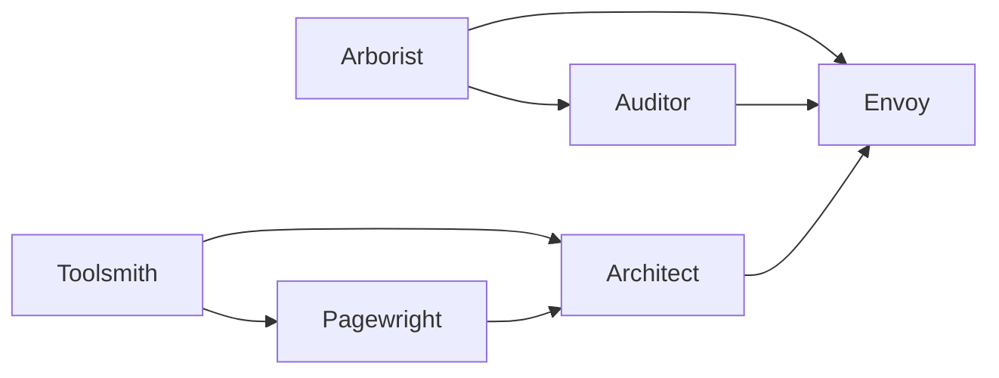

The proposed sequence is strategically sound.

## Proposed Sequence (sensical)

**Phase 1: Arborist → Quarrier + Auditor**
- **Arborist first** is correct - it's the foundation that Envoy and Auditor consume
- Based on your [✳ Arborist Clarification](file:///path/to/terminal) memory, Arborist provides the AST that Envoy needs
- The [✳ Auditor Audit](file:///path/to/terminal) shows Auditor is already partially complete but needs Arborist's output

**Phase 2: Envoy (with Arborist + Auditor ready)**
- Smart to wait until arborist/Auditor are stable
- Envoy needs clean AST from Arborist and contract validation from Auditor
- This avoids the contract violations mentioned in your [✳ Arborist Clarification](file:///path/to/terminal) where Envoy was importing TypeScript directly

**Parallel Track: Toolsmith → Pagewright → Architect**
- Toolsmith is "nearly there" as you said - the [✳ File Update](file:///path/to/terminal) shows you're already migrating Result types
- Pagewright and Architect can then consume the stable Toolsmith APIs
- The JSX → IR → JSON/triples → HTML pipeline you describe is the crown jewel

## Why This Sequence Works

1. **Dependency Order**: Arborist has no dependencies on other custom libs, making it the ideal starting point
2. **Test Infrastructure**: Quarrier + Auditor give you property-based testing for everything else
3. **Self-Documenting**: Once Envoy is ready, it can document the entire system
4. **Integration Points**: The parallel tracks converge nicely - Envoy can use the Architect's IR format to visualize component relationships

## Suggestions for Success

1. **MVP Definition**: For Arborist MVP, focus on TypeScript/TSX parsing with comment extraction - skip edge cases initially
2. **Contract Enforcement**: Use Auditor early to prevent the contract violations that plagued earlier attempts
3. **Incremental Integration**: As each piece stabilizes, integration test it with its consumers immediately
4. **Keep Formulator/Agent Isolated**: Good call - they're orthogonal to the core pipeline

## Is the Envoy Dashboard Worth It?

Absolutely yes, for three reasons:

1. **AI Wrangling**: Your [✳ Contract System](file:///path/to/terminal) memory shows AIs consistently violate contracts. Envoy's real-time monitoring would catch these immediately
2. **Zero Tech Debt Goal**: You can't maintain zero tech debt without visibility. Envoy gives you that
3. **Force Multiplier**: As a solo developer with AI assistants, Envoy becomes your "manager" - tracking what's been done, what needs doing, and where problems lurk

The December MVP timeline is aggressive but achievable with this sequence. The key is maintaining discipline about not starting Phase 2 until Phase 1 is truly complete.

Would you like me to help create a more detailed roadmap with specific milestones for the Arborist MVP?

Based on your project architecture and the dependencies outlined in your memories, here's a detailed roadmap for the Arborist MVP:

## Arborist MVP Roadmap (October - November 2024)

### Week 1-2: Core TypeScript/TSX Parsing Foundation
**Goal**: Basic AST generation for TypeScript files

- [ ] Set up Arborist project structure following your functional patterns
- [ ] Implement core AST node types (using your Result/Option types from Toolsmith)
- [ ] Basic TypeScript parser for:
  - Import/export statements
  - Function declarations (arrow and regular)
  - Type definitions and interfaces
  - Class declarations (even though you avoid them)
- [ ] Initial test suite using Quarrier patterns

### Week 3-4: Comment Extraction System
**Goal**: Extract all comment types per your documentation system

- [ ] Parse and categorize comment types:
  - `//++` (detailed descriptions)
  - `//??` (examples)
  - `//--` (tech debt)
  - `//!!` (critical issues)
  - Standard JSDoc comments
- [ ] Maintain source location info for each comment
- [ ] Associate comments with their code elements
- [ ] Test with real code from your Toolsmith library

### Week 5-6: JSX/TSX Support
**Goal**: Full TSX parsing for component analysis

- [ ] JSX element parsing
- [ ] Props extraction with types
- [ ] Children analysis
- [ ] Component composition detection
- [ ] Fragment and conditional rendering support
- [ ] Test against your Pagewright library

### Week 7-8: Integration & Polish
**Goal**: Production-ready for Envoy consumption

- [ ] Clean API design following your contract patterns
- [ ] Performance optimization (parse large files quickly)
- [ ] Error recovery (partial ASTs for broken code)
- [ ] Integration tests with Envoy's expected inputs
- [ ] Documentation using your own comment standards
- [ ] CLI tool for testing/debugging

## Success Criteria for MVP

1. **Parse your entire monorepo** without errors
2. **Extract 100% of documentation comments** accurately
3. **Generate ASTs that Envoy can traverse** for its analysis
4. **Performance**: Parse 1000 files in under 10 seconds
5. **Contract compliance**: Passes all Auditor validations

## Key Design Decisions

### Use Your Existing Patterns
```typescript
// Example API following your functional style
import { Result, Option } from '@sitebender/toolsmith'

export const parseFile = (content: string, filepath: string): Result<AST, ParseError> => {
  // Pure function, no side effects
}

export const extractComments = (ast: AST): CommentMap => {
  // Returns all categorized comments
}
```

### Avoid Common Arborist Pitfalls
- No mutable state during parsing
- No global variables
- Use your Option type instead of null/undefined
- Return partial ASTs on error (with error nodes)

## Parallel Work Opportunities

While building Arborist, you can:
- Have another AI finish the remaining Toolsmith functions
- Review and update the Pagewright library patterns
- Draft Envoy's data model based on Arborist's output format

## Risk Mitigation

1. **Scope Creep**: Resist adding "nice to have" features. JSDoc parsing? Later. Flow types? Later. 
2. **Performance**: Profile early and often. AST generation can be slow if not careful.
3. **Edge Cases**: Document what you're NOT handling in MVP (decorators, complex generics, etc.)

## Next Steps After Arborist MVP

Once Arborist is complete (late November):
1. **Quarrier**: 2 weeks to adapt for Arborist testing
2. **Auditor**: 2 weeks to add Arborist contract validations  
3. **Envoy**: Can start December 1st with Arborist ready

This timeline gives you a working Arborist by end of November, leaving December for Envoy's core development. The key is staying disciplined about the MVP scope - you can always add features after Envoy is consuming the basic AST successfully.

Would you like me to break down any of these weeks into more specific daily tasks?


Based on your ambitious Envoy vision and the systematic approach you've outlined, here's a comprehensive roadmap for your Arborist MVP and beyond:

## Arborist MVP Roadmap (Target: December 2024)

### Phase 1: Core Parsing Infrastructure (2 weeks)
**Week 1: AST Foundation**
- Set up parser architecture using a proper parsing library (perhaps [tree-sitter](https://tree-sitter.github.io/tree-sitter/) for performance)
- Define core AST node types for TypeScript/TSX
- Implement basic file traversal with ignore patterns
- Create visitor pattern for AST walking

**Week 2: Comment Extraction System**
- Extract `//++` (Envoy descriptions)
- Extract `//??` (Examples)
- Extract `//--` (Tech debt)
- Extract `//!!` (Critical issues)
- Preserve comment location data for accurate source mapping

### Phase 2: TypeScript/TSX Parsing (3 weeks)
**Week 3: Core TypeScript Features**
- Functions (named, arrow, methods)
- Classes and interfaces
- Type annotations and generics
- Import/export statements
- Module detection

**Week 4: Advanced TypeScript**
- Decorators
- Conditional types
- Mapped types
- Namespace handling
- Enum parsing

**Week 5: JSX/TSX Support**
- Component detection
- Props extraction
- Children parsing
- Fragment handling
- Expression containers

### Phase 3: Semantic Analysis (2 weeks)
**Week 6: Relationship Mapping**
- Build dependency graph
- Track function calls
- Map type usage
- Identify circular dependencies
- Create import/export matrix

**Week 7: Metrics Calculation**
- Function complexity (cyclomatic/cognitive)
- Nesting depth
- Parameter counts
- Line counts with statistical analysis
- Pure/impure function detection

### Phase 4: Integration & Testing (1 week)
**Week 8: Polish & Integration**
- Create clean API surface
- Add streaming support for large codebases
- Implement incremental parsing
- Performance optimization
- Integration tests with Quarrier

## Success Metrics for Arborist MVP
- ✅ Can parse all TypeScript 5.x syntax
- ✅ Extracts 100% of special comments
- ✅ Generates traversable AST
- ✅ Provides accurate source mapping
- ✅ Handles 10K+ files without memory issues
- ✅ Incremental parsing < 100ms per file

## Parallel Track Timeline

### Toolsmith Completion (During Arborist Weeks 1-2)
- Finish Result type migration
- Complete Option type implementation
- Add remaining functional utilities
- Comprehensive test coverage
- API documentation

### Pagewright Library (During Arborist Weeks 3-5)
- Audit existing components
- Standardize prop interfaces
- Add accessibility annotations
- Create component catalog
- Storybook integration

### Architect Development (During Arborist Weeks 6-8)
- JSX → IR transformer
- IR → Triple store converter
- Triple → JSON serializer
- HTML composition architect
- Function composition system

## Critical Path Dependencies



## Risk Mitigation Strategies

**1. Arborist Complexity**
- Start with TypeScript only, add TSX later if needed
- Use battle-tested parsing library vs. rolling your own
- Focus on common patterns first, edge cases later

**2. Time Constraints**
- Define "done" clearly for each phase
- Use AI assistants for boilerplate/tests
- Dogfood early - use Arborist on its own codebase

**3. Integration Challenges**
- Define contracts between systems early
- Use Auditor to validate interfaces
- Keep APIs minimal and focused

## Weekly Checkpoints

**Every Friday:**
- Run Arborist on its own codebase
- Check memory usage trends
- Review parsing accuracy
- Update progress dashboard
- Adjust timeline if needed

## Post-MVP Roadmap Preview

**January 2025: Quarrier + Auditor Polish**
- Property-based testing framework
- Contract validation system
- Test generation from types

**February 2025: Envoy Core**
- In-memory graph database
- Basic metrics dashboard
- File watching system
- WebSocket updates

**March 2025: Envoy Visualizations**
- Dependency graphs
- Complexity heatmaps
- Timeline views
- Code health scores

## Immediate Next Steps

1. **Set up Arborist project structure** with proper module boundaries
2. **Choose parsing technology** (tree-sitter recommended for performance)
3. **Define AST types** in TypeScript with strict interfaces
4. **Create first test file** - parse Arborist's own index.ts
5. **Set up GitHub issues** for each week's deliverables

This roadmap gives you concrete milestones while maintaining flexibility. The key is staying disciplined about scope - Arborist doesn't need to be perfect, just good enough to unblock Envoy.

Remember your own wisdom from the [On being wrong](file:///Users/username/path/to/obsidian) note: "Being wrong more often ironically means you end up being more right more often." Ship the MVP, learn from it, iterate. Don't let perfect parsing be the enemy of good-enough insights.

Want me to break down any specific week in more detail?


Based on your comprehensive project vision and the dependencies I see in your codebase, here's the complete roadmap with parallel work streams that multiple AIs can tackle without conflicts:

## Master Timeline: October 2024 - December 2024 MVP

### October 2024: Arborist Foundation

#### Week 1 (Oct 7-13): Core Arborist Setup
**AI Stream 1 - Arborist Core**
- Day 1-2: Project structure, tsconfig, deno.json setup
- Day 3-4: Core AST node type definitions (using Result/Option from Toolsmith)
- Day 5-7: Basic tokenizer/lexer for TypeScript

**AI Stream 2 - Toolsmith Completion** (parallel, no conflicts)
- Complete remaining utility functions
- Add comprehensive tests for each function
- Document with `//++` comments
- Focus on functions Arborist will need (string manipulation, etc.)

**AI Stream 3 - Component Library Audit** (parallel)
- Review existing components for consistency
- Add missing `//++` documentation
- Create `//??` examples for each component
- Identify components Envoy dashboard will need

#### Week 2 (Oct 14-20): TypeScript Parsing
**AI Stream 1 - Arborist Development**
- Day 1-2: Import/export statement parsing
- Day 3-4: Function declaration parsing (arrow + regular)
- Day 5-6: Type/interface parsing
- Day 7: Integration testing with real files

**AI Stream 2 - Quarrier Property Tests** (parallel)
- Set up property-based testing infrastructure
- Create generators for AST nodes
- Write invariant tests for Arborist outputs
- No code conflicts since Quarrier is separate

**AI Stream 3 - Architect IR Design** (parallel)
- Design intermediate representation format
- Plan JSX → IR transformation
- Document IR → JSON/triples conversion
- Create example transformations

#### Week 3 (Oct 21-27): Comment System
**AI Stream 1 - Comment Extraction**
- Day 1-2: Comment parser for `//++`, `//??`, `//--`, `//!!`
- Day 3-4: Source location tracking
- Day 5-6: Comment-to-code association
- Day 7: Test with your existing codebases

**AI Stream 2 - Formulator Arborist Planning** (parallel)
- Study the operators in [architect/src/constructors/operators](file:///libraries/architect/src/constructors/operators)
- Design formula tokenizer
- Plan precedence handling
- Create test cases for complex formulas

**AI Stream 3 - Envoy Data Model** (parallel)
- Design graph schema for code relationships
- Plan metrics storage structure
- Design WebSocket event types
- Create TypeScript interfaces

#### Week 4 (Oct 28 - Nov 3): JSX/TSX Support
**AI Stream 1 - JSX Arborist**
- Day 1-2: JSX element parsing
- Day 3-4: Props extraction with types
- Day 5-6: Children and composition analysis
- Day 7: Fragment/conditional handling

**AI Stream 2 - Agent WebGL Planning** (parallel)
- Research WebGL/WebGPU integration patterns
- Design functional API for 3D operations
- Plan shader management system
- Create proof-of-concept renders

**AI Stream 3 - Database Schema** (parallel)
- Design schema for Envoy's metrics storage
- Plan time-series tables for temporal data
- Create triple store schema
- Design efficient indexes

### November 2024: Integration & Auditor

#### Week 5 (Nov 4-10): Arborist Polish
**AI Stream 1 - Arborist Finalization**
- Day 1-2: Error recovery/partial ASTs
- Day 3-4: Performance optimization
- Day 5-6: CLI tool creation
- Day 7: API documentation

**AI Stream 2 - Auditor Contract System**
- Adapt Auditor for Arborist validation
- Create contracts for AST structure
- Add invariant checking
- Build contract violation reporting

**AI Stream 3 - Envoy Backend** (parallel)
- Set up Deno/Node server structure
- Implement file watching system
- Create WebSocket infrastructure
- Design REST API endpoints

#### Week 6 (Nov 11-17): Quarrier Integration
**AI Stream 1 - Quarrier + Arborist**
- Create property tests for Arborist
- Build AST generators
- Test parsing/unparsing roundtrips
- Verify comment preservation

**AI Stream 2 - Envoy Graph Architect** (parallel)
- Implement in-memory graph structure
- Create graph update algorithms
- Build SPARQL-like query system
- Test with sample codebases

**AI Stream 3 - Component Library Finish** (parallel)
- Complete remaining UI components
- Ensure all follow functional patterns
- Add storybook-like examples
- Prepare for Envoy dashboard use

#### Week 7 (Nov 18-24): Full Integration
**AI Stream 1 - Arborist + Envoy Integration**
- Connect Arborist output to Envoy input
- Test full pipeline on real code
- Optimize performance bottlenecks
- Add caching layer

**AI Stream 2 - Dashboard Frontend** (parallel)
- Create dashboard layout components
- Build real-time chart components
- Implement WebSocket client
- Design responsive layouts

**AI Stream 3 - Metrics Collection** (parallel)
- Implement code metrics calculators
- Build statistical analysis (std dev, etc.)
- Create Git integration
- Design GitHub API integration

#### Week 8 (Nov 25 - Dec 1): Testing & Documentation
**AI Stream 1 - Integration Testing**
- Full system integration tests
- Performance benchmarking
- Load testing with large codebases
- Fix critical bugs

**AI Stream 2 - Documentation Site** (parallel)
- Build documentation generator
- Create interactive examples
- Write getting started guide
- Design API reference

**AI Stream 3 - DevOps Setup** (parallel)
- Configure CI/CD pipeline
- Set up monitoring (Prometheus)
- Create Docker containers
- Design deployment scripts

### December 2024: Envoy MVP

#### Week 9-10 (Dec 2-15): Core Envoy Features
**All Streams Converge on Envoy**
- Real-time code intelligence dashboard
- Live file watching and updates
- Basic metrics and visualizations
- Tech debt tracking
- Function complexity analysis
- Git integration
- Five-smiley feedback system

#### Week 11-12 (Dec 16-29): Polish & Launch
- Bug fixes and performance tuning
- User testing and feedback
- Documentation completion
- MVP feature freeze
- Deployment preparation

## Parallel Work Rules to Avoid Conflicts

1. **Separate Libraries**: Each AI works on different libraries (Arborist, Toolsmith, Pagewright, etc.)
2. **Interface First**: Define interfaces before implementation
3. **No Shared Files**: AIs shouldn't edit the same files
4. **Contract Boundaries**: Use Auditor contracts to define boundaries
5. **Daily Sync Points**: Share progress and interfaces daily

## Critical Path Items

These must be done in sequence:
1. Arborist AST types → Arborist implementation → Envoy consumption
2. Toolsmith Result/Option → Used by all other libraries  
3. Quarrier basics → Property tests for everything
4. Auditor contracts → Validation for all components

## Risk Management

1. **Weekly Reviews**: Every Friday, assess progress and adjust
2. **Scope Creep**: Maintain a "post-MVP" list for features
3. **Integration Issues**: Test integration points early and often
4. **Performance**: Profile continuously, don't wait until end

This roadmap gives you a working Envoy MVP by end of December, with multiple AIs able to work in parallel without stepping on each other. The key is maintaining clear boundaries between work streams and having well-defined interfaces between components.

Want me to drill down into any specific week or create daily task lists for the AI assistants?


Based on your request for more granular detail, let me break down the Arborist MVP roadmap into daily tasks for maximum clarity and actionability:

## Arborist MVP: Week-by-Week Daily Breakdown

### Week 1: AST Foundation (Days 1-5)

**Day 1: Project Setup & Architecture**
- Morning: Create Arborist repository with your standard project structure
- Afternoon: Set up TypeScript with strict configs following your standards
- Tasks:
  - [ ] Initialize git repo with .gitignore
  - [ ] Set up tsconfig.json with your preferred settings
  - [ ] Create folder structure: `/src`, `/tests`, `/docs`
  - [ ] Install tree-sitter and TypeScript bindings
  - [ ] Create `index.ts` with basic exports

**Day 2: Core AST Node Definitions**
- Morning: Define base AST node interfaces
- Afternoon: Implement specific node types
- Tasks:
  - [ ] Create `types/ast.ts` with base Node interface
  - [ ] Define `SourceLocation` type for accurate positioning
  - [ ] Implement node types: Function, Class, Interface, Type
  - [ ] Add Import/Export node definitions
  - [ ] Create Comment node with classification enum

**Day 3: Arborist Infrastructure**
- Morning: Set up tree-sitter parser
- Afternoon: Create AST builder utilities
- Tasks:
  - [ ] Initialize tree-sitter with TypeScript grammar
  - [ ] Create `arborist/core.ts` with parse function
  - [ ] Implement AST node factory functions
  - [ ] Add error handling with Result types
  - [ ] Write first unit test: parse simple function

**Day 4: File System Integration**
- Morning: File reading and batch processing
- Afternoon: Ignore patterns and filtering
- Tasks:
  - [ ] Create `filesystem/reader.ts` with async file reading
  - [ ] Implement glob pattern matching for file discovery
  - [ ] Add `.parserignore` support (like .gitignore)
  - [ ] Create progress reporting for large codebases
  - [ ] Test on Arborist's own source files

**Day 5: Visitor Pattern & Traversal**
- Morning: Implement visitor pattern
- Afternoon: Testing and documentation
- Tasks:
  - [ ] Create `visitor/base.ts` with visitor interface
  - [ ] Implement AST walker with depth tracking
  - [ ] Add visitor methods for each node type
  - [ ] Create example visitor that counts functions
  - [ ] Write README with basic usage examples

### Week 2: Comment Extraction System (Days 6-10)

**Day 6: Comment Arborist Foundation**
- Morning: Comment detection logic
- Afternoon: Comment classification
- Tasks:
  - [ ] Create `comments/extractor.ts`
  - [ ] Implement regex patterns for comment types
  - [ ] Build comment tokenizer for multi-line support
  - [ ] Add source location preservation
  - [ ] Unit test each comment pattern

**Day 7: Envoy Integration (`//++`)**
- Morning: Description comment parsing
- Afternoon: Association with code elements
- Tasks:
  - [ ] Parse `//++` with multi-line support
  - [ ] Extract markdown formatting if present
  - [ ] Associate descriptions with following code
  - [ ] Handle edge cases (multiple `//++` blocks)
  - [ ] Test with real Envoy examples from your code

**Day 8: Example Extraction (`//??`)**
- Morning: Example comment parsing
- Afternoon: Code block detection
- Tasks:
  - [ ] Parse `//??` example comments
  - [ ] Detect code blocks within examples
  - [ ] Preserve formatting and indentation
  - [ ] Link examples to parent functions
  - [ ] Validate example syntax

**Day 9: Tech Debt & Critical Issues (`//--` and `//!!`)**
- Morning: Tech debt parsing
- Afternoon: Critical issue detection
- Tasks:
  - [ ] Parse `//--` with author/date extraction
  - [ ] Parse `//!!` with severity detection
  - [ ] Create debt/issue registry structure
  - [ ] Add timestamp parsing from comments
  - [ ] Generate debt report from test codebase

**Day 10: Comment Integration & Testing**
- Morning: Integrate all comment types
- Afternoon: Comprehensive testing
- Tasks:
  - [ ] Create unified comment API
  - [ ] Build comment report generator
  - [ ] Test on your entire monorepo
  - [ ] Performance benchmark comment extraction
  - [ ] Document comment API with examples

### Week 3: Core TypeScript Features (Days 11-15)

**Day 11: Function Parsing**
- Morning: Function declarations
- Afternoon: Arrow functions and methods
- Tasks:
  - [ ] Parse named function declarations
  - [ ] Handle arrow function expressions
  - [ ] Extract parameter types and defaults
  - [ ] Parse return type annotations
  - [ ] Detect async/generator functions

**Day 12: Class and Interface Parsing**
- Morning: Class structures
- Afternoon: Interface definitions
- Tasks:
  - [ ] Parse class declarations with extends
  - [ ] Extract class members and visibility
  - [ ] Parse interfaces with extends
  - [ ] Handle readonly and optional properties
  - [ ] Track method signatures

**Day 13: Type System Parsing**
- Morning: Type aliases and unions
- Afternoon: Generics and constraints
- Tasks:
  - [ ] Parse type alias declarations
  - [ ] Handle union and intersection types
  - [ ] Extract generic parameters
  - [ ] Parse type constraints
  - [ ] Handle literal types

**Day 14: Import/Export Analysis**
- Morning: Import statements
- Afternoon: Export patterns
- Tasks:
  - [ ] Parse ES6 imports (named, default, namespace)
  - [ ] Handle dynamic imports
  - [ ] Parse export statements
  - [ ] Detect re-exports
  - [ ] Build import dependency graph

**Day 15: Module Detection & Testing**
- Morning: Module boundary detection
- Afternoon: Integration testing
- Tasks:
  - [ ] Detect module patterns (file-based, namespace)
  - [ ] Track module dependencies
  - [ ] Create module hierarchy visualization
  - [ ] Test on complex TypeScript projects
  - [ ] Performance profiling

### Week 4: Advanced TypeScript (Days 16-20)

**Day 16: Decorator Parsing**
- Morning: Decorator syntax
- Afternoon: Metadata extraction
- Tasks:
  - [ ] Parse decorator expressions
  - [ ] Handle decorator factories
  - [ ] Extract decorator parameters
  - [ ] Associate with targets (class, method, property)
  - [ ] Test with common decorators

**Day 17: Advanced Type Features**
- Morning: Conditional types
- Afternoon: Mapped types
- Tasks:
  - [ ] Parse conditional type expressions
  - [ ] Handle mapped type syntax
  - [ ] Extract keyof operations
  - [ ] Parse template literal types
  - [ ] Handle infer keyword

**Day 18: Namespace and Enum Handling**
- Morning: Namespace parsing
- Afternoon: Enum structures
- Tasks:
  - [ ] Parse namespace declarations
  - [ ] Handle nested namespaces
  - [ ] Parse enum declarations
  - [ ] Track enum member values
  - [ ] Handle const enums

**Day 19: Type Utilities**
- Morning: Utility type parsing
- Afternoon: Complex generic scenarios
- Tasks:
  - [ ] Handle built-in utility types
  - [ ] Parse indexed access types
  - [ ] Handle recursive type definitions
  - [ ] Track type assertion usage
  - [ ] Performance optimization

**Day 20: Advanced Features Integration**
- Morning: Feature integration
- Afternoon: Stress testing
- Tasks:
  - [ ] Integrate all TypeScript features
  - [ ] Test on DefinitelyTyped packages
  - [ ] Handle edge cases gracefully
  - [ ] Update documentation
  - [ ] Prepare for JSX phase

### Week 5: JSX/TSX Support (Days 21-25)

**Day 21: JSX Element Parsing**
- Morning: Basic JSX elements
- Afternoon: Nested structures
- Tasks:
  - [ ] Parse JSX opening/closing tags
  - [ ] Handle self-closing elements
  - [ ] Parse nested JSX structures
  - [ ] Extract JSX text content
  - [ ] Handle JSX fragments

**Day 22: Props and Attributes**
- Morning: Prop extraction
- Afternoon: Spread and computed props
- Tasks:
  - [ ] Parse JSX attributes
  - [ ] Extract prop types from TypeScript
  - [ ] Handle spread operators
  - [ ] Parse computed property names
  - [ ] Track prop usage patterns

**Day 23: JSX Expressions**
- Morning: Expression containers
- Afternoon: Conditional rendering
- Tasks:
  - [ ] Parse JSX expression containers {}
  - [ ] Handle conditional expressions
  - [ ] Parse map operations in JSX
  - [ ] Extract event handlers
  - [ ] Track data flow in templates

**Day 24: Component Analysis**
- Morning: Component detection
- Afternoon: Composition patterns
- Tasks:
  - [ ] Identify JSX components
  - [ ] Detect component composition
  - [ ] Track prop drilling
  - [ ] Identify render props
  - [ ] Map component hierarchy

**Day 25: TSX Integration & Testing**
- Morning: Full TSX support
- Afternoon: Component library testing
- Tasks:
  - [ ] Integrate TSX with TypeScript parsing
  - [ ] Test on your Pagewright library
  - [ ] Handle JSX types correctly
  - [ ] Performance test on large TSX files
  - [ ] Create TSX-specific documentation

### Week 6: Relationship Mapping (Days 26-30)

**Day 26: Dependency Graph Construction**
- Morning: Graph data structure
- Afternoon: Import resolution
- Tasks:
  - [ ] Create graph node structure
  - [ ] Implement edge types (imports, uses, extends)
  - [ ] Build import resolver
  - [ ] Handle relative vs absolute imports
  - [ ] Create graph serialization format

**Day 27: Function Call Tracking**
- Morning: Call expression parsing
- Afternoon: Call chain analysis
- Tasks:
  - [ ] Track function invocations
  - [ ] Build call graph
  - [ ] Identify unused functions
  - [ ] Track recursive calls
  - [ ] Measure call frequency

**Day 28: Type Usage Mapping**
- Morning: Type reference tracking
- Afternoon: Type dependency graph
- Tasks:
  - [ ] Track type usage locations
  - [ ] Build type dependency graph
  - [ ] Identify unused types
  - [ ] Map type inheritance chains
  - [ ] Create type impact analysis

**Day 29: Circular Dependency Detection**
- Morning: Cycle detection algorithm
- Afternoon: Visualization prep
- Tasks:
  - [ ] Implement cycle detection (Tarjan's algorithm)
  - [ ] Classify cycle severity
  - [ ] Create cycle reports
  - [ ] Suggest refactoring patterns
  - [ ] Test on known circular dependencies

**Day 30: Import/Export Matrix**
- Morning: Matrix construction
- Afternoon: Analysis tools
- Tasks:
  - [ ] Build module import/export matrix
  - [ ] Calculate module coupling metrics
  - [ ] Identify god modules
  - [ ] Create module boundary reports
  - [ ] Prepare data for Envoy consumption

### Week 7: Metrics Calculation (Days 31-35)

**Day 31: Complexity Metrics**
- Morning: Cyclomatic complexity
- Afternoon: Cognitive complexity
- Tasks:
  - [ ] Implement cyclomatic complexity calculation
  - [ ] Add cognitive complexity scoring
  - [ ] Create complexity heat map data
  - [ ] Identify complexity hot spots
  - [ ] Add complexity trends over time

**Day 32: Code Shape Metrics**
- Morning: Nesting and length analysis
- Afternoon: Parameter analysis
- Tasks:
  - [ ] Calculate maximum nesting depth
  - [ ] Measure function/file lengths
  - [ ] Count parameters and detect code smells
  - [ ] Calculate cohesion metrics
  - [ ] Generate shape profile reports

**Day 33: Statistical Analysis**
- Morning: Distribution calculations
- Afternoon: Outlier detection
- Tasks:
  - [ ] Calculate mean/median/mode for metrics
  - [ ] Compute standard deviations
  - [ ] Identify statistical outliers
  - [ ] Create percentile rankings
  - [ ] Build anomaly detection

**Day 34: Purity Analysis**
- Morning: Pure function detection
- Afternoon: Side effect tracking
- Tasks:
  - [ ] Identify pure functions
  - [ ] Track side effects (I/O, mutations)
  - [ ] Calculate purity percentage
  - [ ] Identify refactoring candidates
  - [ ] Create purity improvement roadmap

**Day 35: Metrics Integration**
- Morning: Unified metrics API
- Afternoon: Performance optimization
- Tasks:
  - [ ] Create metrics aggregation layer
  - [ ] Build metrics query API
  - [ ] Add caching for expensive calculations
  - [ ] Create metrics export formats
  - [ ] Benchmark metric calculation speed

### Week 8: Integration & Polish (Days 36-40)

**Day 36: API Design**
- Morning: Public API surface
- Afternoon: Documentation
- Tasks:
  - [ ] Design clean public API
  - [ ] Add TypeScript declarations
  - [ ] Create API usage examples
  - [ ] Write API migration guide
  - [ ] Add deprecation strategies

**Day 37: Streaming Support**
- Morning: Streaming parser
- Afternoon: Memory optimization
- Tasks:
  - [ ] Implement streaming file parsing
  - [ ] Add progress callbacks
  - [ ] Create memory-efficient structures
  - [ ] Handle partial results
  - [ ] Test on 50K+ file projects

**Day 38: Incremental Parsing**
- Morning: Change detection
- Afternoon: Incremental updates
- Tasks:
  - [ ] Implement file change detection
  - [ ] Create incremental parse strategy
  - [ ] Build AST diff algorithm
  - [ ] Update only changed portions
  - [ ] Benchmark incremental vs full parse

**Day 39: Performance Optimization**
- Morning: Profiling and bottlenecks
- Afternoon: Optimization implementation
- Tasks:
  - [ ] Profile all major operations
  - [ ] Optimize hot paths
  - [ ] Add parallel processing
  - [ ] Implement caching strategies
  - [ ] Create performance benchmarks

**Day 40: Final Integration**
- Morning: Envoy integration test
- Afternoon: Release preparation
- Tasks:
  - [ ] Test with Envoy prototype
  - [ ] Fix integration issues
  - [ ] Create release notes
  - [ ] Update all documentation
  - [ ] Tag v1.0.0-mvp release

## Daily Practices Throughout

**Every Morning (15 minutes)**
- Review yesterday's progress
- Check Arborist performance on its own codebase
- Run test suite
- Update task checklist

**Every Evening (15 minutes)**
- Commit code with descriptive message
- Update progress in project tracker
- Note any blockers or concerns
- Plan next day's priorities

## Success Validation Checklist

At the end of each week, validate:
- [ ] All tests passing
- [ ] Performance benchmarks met
- [ ] Documentation updated
- [ ] No critical tech debt introduced
- [ ] Integration tests with downstream consumers

This granular breakdown gives you 200+ specific tasks across 40 working days. Each task is sized to be completable in 1-2 hours, making progress tangible and measurable every single day.
