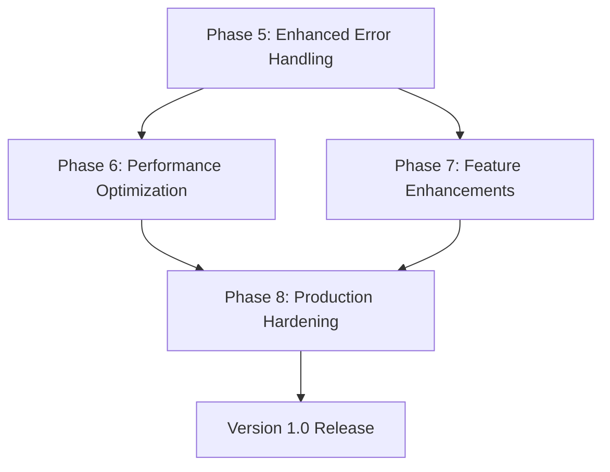

# Arborist Next Development Phases

**Last Updated:** 2025-10-08
**Status:** Planning Document
**AI Instructions:** Read this ENTIRE document before implementing any phase.

## Current State

Arborist Phases 1-4 are complete and production-ready:
- ✅ Phase 1: Documentation updates
- ✅ Phase 2: Type system updates
- ✅ Phase 3: Core API implementation
- ✅ Phase 4: Integration and testing

**Current Capabilities:**
- Fast SWC WASM-based parsing
- Result/Validation monadic error handling
- Seven extraction functions (functions, comments, imports, exports, types, constants, violations)
- 176 passing tests with 100% pass rate
- Constitutional compliance verified
- Performance targets met (<3s for all tests)

**Known Limitations:**
- Extraction functions currently never fail (return success directly)
- No individual extraction error handling with Validation accumulation
- Limited error recovery strategies
- Generic error messages in some edge cases

## Phase 5: Enhanced Error Handling (PRIORITY)

**Rationale:** The current implementation has TODO(Phase5) comments in all five main extractors indicating that error handling needs enhancement. While the infrastructure for Validation-based error accumulation exists, individual extraction operations don't yet leverage it. This phase will make Arborist more robust and provide better diagnostics when parsing complex or malformed code.

**Goal:** Transform extractors from "never fail" operations into robust functions that detect, accumulate, and report errors with helpful suggestions while supporting partial success.

### 5.1 Error Detection Infrastructure

- [ ] Create error detection helpers in `src/_helpers/`
  - [ ] `createExtractionError` - Factory for extraction errors with span info
  - [ ] `validateNodeType` - Type guard with error generation
  - [ ] `validateIdentifier` - Identifier validation with suggestions
  - [ ] `validateSpan` - Span validation and normalization
  - [ ] Write comprehensive tests for each helper

### 5.2 Function Extraction Error Handling

**File:** [`src/extractFunctions/index.ts`](../src/extractFunctions/index.ts:39)

- [ ] Implement error detection for unknown node types
  - [ ] Detect unsupported function-like constructs
  - [ ] Generate helpful suggestions for alternatives
  - [ ] Include node type and span in error
- [ ] Implement error detection for missing identifiers
  - [ ] Handle anonymous function expressions
  - [ ] Suggest naming conventions
  - [ ] Provide context about where identifier is missing
- [ ] Implement error detection for invalid parameter structures
  - [ ] Detect malformed destructuring patterns
  - [ ] Handle rest parameters edge cases
  - [ ] Validate parameter type annotations
- [ ] Update [`extractFunctionDetails`](../src/extractFunctionDetails/index.ts:1) to return Validation
  - [ ] Accumulate parameter extraction errors
  - [ ] Accumulate type parameter errors
  - [ ] Support partial success (extract what's valid)
- [ ] Add error accumulation in main extraction loop
  - [ ] Use Toolsmith validation combinators
  - [ ] Continue extraction on individual failures
  - [ ] Collect all errors before returning
- [ ] Write comprehensive error handling tests
  - [ ] Test each error kind independently
  - [ ] Test error accumulation across multiple functions
  - [ ] Test partial success scenarios
  - [ ] Verify error messages include suggestions

### 5.3 Import Extraction Error Handling

**File:** [`src/extractImports/index.ts`](../src/extractImports/index.ts:39)

- [ ] Implement error detection for invalid specifiers
  - [ ] Detect malformed import paths
  - [ ] Validate relative vs absolute paths
  - [ ] Suggest corrections for common mistakes
- [ ] Implement error detection for unknown import kinds
  - [ ] Handle edge cases in import syntax
  - [ ] Detect unsupported import patterns
  - [ ] Provide examples of supported patterns
- [ ] Update [`extractImportDetails`](../src/extractImports/index.ts:1) to return Validation
  - [ ] Validate import bindings
  - [ ] Handle type-only import edge cases
  - [ ] Support partial extraction
- [ ] Add error accumulation in extraction loop
- [ ] Write comprehensive tests

### 5.4 Export Extraction Error Handling

**File:** [`src/extractExports/index.ts`](../src/extractExports/index.ts:39)

- [ ] Implement error detection for invalid export names
  - [ ] Validate identifier syntax
  - [ ] Detect reserved word conflicts
  - [ ] Suggest valid alternatives
- [ ] Implement error detection for unknown export kinds
  - [ ] Handle complex export patterns
  - [ ] Detect unsupported re-export syntax
  - [ ] Provide clear examples
- [ ] Update [`extractExportDetails`](../src/extractExports/index.ts:1) to return Validation
  - [ ] Validate export declarations
  - [ ] Handle re-export edge cases
  - [ ] Support partial extraction
- [ ] Add error accumulation in extraction loop
- [ ] Write comprehensive tests

### 5.5 Type Extraction Error Handling

**File:** [`src/extractTypes/index.ts`](../src/extractTypes/index.ts:68)

- [ ] Implement error detection for unknown type kinds
  - [ ] Detect unsupported type constructs
  - [ ] Handle complex generic types
  - [ ] Suggest simpler alternatives when appropriate
- [ ] Implement error detection for missing type names
  - [ ] Validate type alias identifiers
  - [ ] Handle interface name requirements
  - [ ] Provide naming suggestions
- [ ] Update [`extractTypeDetails`](../src/extractTypes/index.ts:1) to return Validation
  - [ ] Validate type definitions
  - [ ] Handle type parameter edge cases
  - [ ] Support partial extraction
- [ ] Add error accumulation in extraction loop
- [ ] Write comprehensive tests

### 5.6 Constant Extraction Error Handling

**File:** [`src/extractConstants/index.ts`](../src/extractConstants/index.ts:76)

- [ ] Implement error detection for non-const declarations
  - [ ] Detect `let` or `var` misidentified as const
  - [ ] Validate const semantics
  - [ ] Suggest const usage patterns
- [ ] Implement error detection for missing values
  - [ ] Handle uninitialized const declarations
  - [ ] Validate value expressions
  - [ ] Provide initialization examples
- [ ] Update [`extractConstantDetails`](../src/extractConstants/index.ts:1) to return Validation
  - [ ] Validate constant declarations
  - [ ] Handle complex initializers
  - [ ] Support partial extraction
- [ ] Add error accumulation in extraction loop
- [ ] Write comprehensive tests

### 5.7 Error Recovery Strategies

- [ ] Document error recovery patterns in `docs/error-handling.md`
  - [ ] When to continue vs fail fast
  - [ ] Partial success guidelines
  - [ ] Error accumulation best practices
- [ ] Implement graceful degradation
  - [ ] Return empty arrays for completely failed extractions
  - [ ] Preserve successfully extracted items
  - [ ] Include all errors in Failure
- [ ] Add error context enrichment
  - [ ] Include surrounding code context
  - [ ] Add file path to all errors
  - [ ] Preserve original AST node references

### 5.8 Error Message Improvements

- [ ] Audit all error messages for clarity
  - [ ] Ensure operation name is clear
  - [ ] Include specific failure details
  - [ ] Verify span information is accurate
- [ ] Enhance all suggestions
  - [ ] Provide actionable next steps
  - [ ] Include code examples where helpful
  - [ ] Link to documentation when relevant
- [ ] Add error categorization
  - [ ] Syntax errors vs semantic errors
  - [ ] Recoverable vs fatal errors
  - [ ] User errors vs library bugs

### 5.9 Integration and Testing

- [ ] Update [`buildParsedFile`](../src/buildParsedFile/index.ts:1) integration
  - [ ] Verify error accumulation across all extractors
  - [ ] Test partial success scenarios
  - [ ] Ensure error messages are helpful
- [ ] Comprehensive error handling test suite
  - [ ] Test each error kind for each extractor
  - [ ] Test error accumulation patterns
  - [ ] Test partial success with various failure combinations
  - [ ] Property tests for error invariants
- [ ] Performance verification
  - [ ] Ensure error handling doesn't degrade performance
  - [ ] Benchmark error path vs success path
  - [ ] Verify memory usage remains acceptable
- [ ] Documentation updates
  - [ ] Update README.md with error handling examples
  - [ ] Enhance error-handling.md with new patterns
  - [ ] Add troubleshooting section to START_HERE.md

**AI Instructions for Phase 5:**
- Study the existing Validation infrastructure in Toolsmith thoroughly
- Each extractor should follow the same error handling pattern
- Write tests FIRST for each error scenario (TDD)
- Ensure all errors include helpful suggestions
- Support partial success - extract what's valid, report what failed
- Never throw exceptions - always return Validation
- Preserve all context in errors (span, node type, operation, args)

## Phase 6: Performance Optimization

**Rationale:** While current performance meets targets, there are opportunities for optimization as the library matures and handles larger codebases. This phase focuses on making Arborist even faster without sacrificing correctness.

**Goal:** Reduce parse and extraction time by 20-30% through strategic optimizations while maintaining 100% test pass rate.

### 6.1 Performance Profiling

- [ ] Set up performance benchmarking infrastructure
  - [ ] Create benchmark suite with representative files
  - [ ] Small files (10-50 functions)
  - [ ] Medium files (100-500 functions)
  - [ ] Large files (1000+ functions)
  - [ ] Establish baseline measurements
- [ ] Profile current implementation
  - [ ] Identify hot paths in extraction functions
  - [ ] Measure AST traversal overhead
  - [ ] Analyze memory allocation patterns
  - [ ] Document bottlenecks

### 6.2 AST Traversal Optimization

- [ ] Optimize [`collectASTNodes`](../src/_helpers/collectASTNodes/index.ts:1)
  - [ ] Reduce redundant traversals
  - [ ] Implement early termination where possible
  - [ ] Consider visitor pattern for multi-extraction
- [ ] Implement single-pass extraction option
  - [ ] Extract all features in one traversal
  - [ ] Maintain separate extraction functions for granular use
  - [ ] Benchmark single-pass vs multi-pass

### 6.3 Caching Strategies

- [ ] Design caching layer for parsed ASTs
  - [ ] Cache key generation (file path + content hash)
  - [ ] LRU cache implementation
  - [ ] Cache invalidation strategy
- [ ] Implement optional AST caching
  - [ ] Add cache configuration to parseFile
  - [ ] Document cache behavior and tradeoffs
  - [ ] Write cache invalidation tests
- [ ] Consider extraction result caching
  - [ ] Cache extracted functions/imports/etc
  - [ ] Invalidate on source changes
  - [ ] Measure cache hit rates

### 6.4 Parallel Extraction

- [ ] Evaluate parallel extraction opportunities
  - [ ] Identify independent extraction operations
  - [ ] Assess Web Worker viability for Deno
  - [ ] Consider async extraction patterns
- [ ] Implement parallel extraction (if beneficial)
  - [ ] Use Deno Workers for CPU-intensive operations
  - [ ] Maintain sequential fallback
  - [ ] Benchmark parallel vs sequential
- [ ] Document parallelization tradeoffs
  - [ ] When to use parallel extraction
  - [ ] Overhead considerations
  - [ ] Memory implications

### 6.5 Memory Optimization

- [ ] Analyze memory usage patterns
  - [ ] Profile memory allocation during parsing
  - [ ] Identify unnecessary object creation
  - [ ] Measure memory footprint per file size
- [ ] Optimize data structures
  - [ ] Use more efficient representations where possible
  - [ ] Reduce intermediate allocations
  - [ ] Consider object pooling for hot paths
- [ ] Implement streaming for large files
  - [ ] Design streaming API for huge files
  - [ ] Process AST in chunks if beneficial
  - [ ] Document streaming limitations

### 6.6 Benchmark Targets

- [ ] Define new performance targets
  - [ ] Small files: <5ms (currently <10ms)
  - [ ] Medium files: <30ms (currently <50ms)
  - [ ] Large files: <150ms (currently <200ms)
- [ ] Continuous performance monitoring
  - [ ] Add performance regression tests
  - [ ] Track metrics over time
  - [ ] Alert on performance degradation

**AI Instructions for Phase 6:**
- Never sacrifice correctness for speed
- Benchmark before and after each optimization
- Document performance characteristics
- Keep optimizations optional where they add complexity
- Maintain 100% test pass rate throughout

## Phase 7: Feature Enhancements

**Rationale:** Based on consumer feedback and anticipated needs, several feature enhancements will make Arborist more capable without expanding its core responsibility.

**Goal:** Add targeted capabilities that enhance extraction quality and provide more detailed metadata.

### 7.1 Enhanced Function Metadata

- [ ] Extract JSDoc comments for functions
  - [ ] Associate JSDoc with function declarations
  - [ ] Parse @param, @returns, @throws tags
  - [ ] Include in ParsedFunction structure
- [ ] Detect function dependencies
  - [ ] Track which functions call which
  - [ ] Identify external dependencies
  - [ ] Build call graph data structure
- [ ] Enhanced complexity metrics
  - [ ] Cognitive complexity (in addition to cyclomatic)
  - [ ] Nesting depth
  - [ ] Parameter complexity score

### 7.2 Comment Association

- [ ] Implement comment-to-node association
  - [ ] Associate comments with nearest function
  - [ ] Handle leading vs trailing comments
  - [ ] Support block-level comments
- [ ] Enhance Envoy marker detection
  - [ ] Support nested markers
  - [ ] Detect marker combinations
  - [ ] Validate marker syntax
- [ ] Add comment classification
  - [ ] Documentation comments
  - [ ] TODO/FIXME/NOTE comments
  - [ ] Disabled code comments
  - [ ] License headers

### 7.3 Import/Export Analysis

- [ ] Detect circular dependencies
  - [ ] Track import chains
  - [ ] Identify circular references
  - [ ] Report dependency cycles
- [ ] Analyze import usage
  - [ ] Track which imports are actually used
  - [ ] Detect unused imports
  - [ ] Suggest import cleanup
- [ ] Enhanced export metadata
  - [ ] Track what's exported vs internal
  - [ ] Identify public API surface
  - [ ] Detect breaking changes in exports

### 7.4 Type System Enhancements

- [ ] Extract generic constraints
  - [ ] Capture constraint expressions
  - [ ] Track constraint relationships
  - [ ] Include in ParsedType
- [ ] Detect type relationships
  - [ ] Track type extends/implements
  - [ ] Build type hierarchy
  - [ ] Identify type dependencies
- [ ] Enhanced type metadata
  - [ ] Utility type detection
  - [ ] Conditional type analysis
  - [ ] Mapped type extraction

### 7.5 Cross-File Analysis Preparation

- [ ] Design cross-file analysis API
  - [ ] Multi-file parsing interface
  - [ ] Dependency graph construction
  - [ ] Module resolution strategy
- [ ] Implement module resolution
  - [ ] Resolve relative imports
  - [ ] Handle path aliases
  - [ ] Support Deno import maps
- [ ] Build project-level data structures
  - [ ] Project AST collection
  - [ ] Cross-file reference tracking
  - [ ] Module dependency graph

### 7.6 Consumer Feedback Integration

- [ ] Gather feedback from Envoy team
  - [ ] What metadata is most useful?
  - [ ] What's missing from current extraction?
  - [ ] What would improve documentation generation?
- [ ] Gather feedback from Auditor team
  - [ ] What coverage analysis needs?
  - [ ] What test generation requires?
  - [ ] What branch detection improvements needed?
- [ ] Gather feedback from Quarrier team
  - [ ] What type information is most valuable?
  - [ ] What would improve test data generation?
  - [ ] What edge cases need better handling?
- [ ] Prioritize and implement top requests
  - [ ] Rank by impact and effort
  - [ ] Implement highest-value features first
  - [ ] Maintain backward compatibility

**AI Instructions for Phase 7:**
- Each enhancement should be independently valuable
- Maintain focus on structural extraction (no semantic analysis)
- Keep API surface clean and focused
- Document each enhancement thoroughly
- Ensure enhancements don't degrade performance

## Phase 8: Production Hardening

**Rationale:** Before declaring 1.0 and committing to semantic versioning, we need to ensure Arborist handles edge cases gracefully and performs reliably under production conditions.

**Goal:** Achieve production-grade reliability with comprehensive edge case handling, stress testing, and monitoring capabilities.

### 8.1 Edge Case Handling

- [ ] Identify edge cases from real-world usage
  - [ ] Collect problematic files from consumers
  - [ ] Document unusual syntax patterns
  - [ ] Create edge case test suite
- [ ] Handle malformed but parseable code
  - [ ] Incomplete function declarations
  - [ ] Unusual whitespace patterns
  - [ ] Mixed syntax styles
- [ ] Handle extreme cases
  - [ ] Very large files (10,000+ lines)
  - [ ] Deeply nested structures
  - [ ] Extremely long identifiers
  - [ ] Unicode in identifiers and strings
- [ ] Improve error messages for edge cases
  - [ ] Specific guidance for unusual patterns
  - [ ] Examples of correct syntax
  - [ ] Links to relevant documentation

### 8.2 Stress Testing

- [ ] Create stress test suite
  - [ ] Parse 1000+ files sequentially
  - [ ] Parse files concurrently
  - [ ] Handle rapid repeated parsing
  - [ ] Test with limited memory
- [ ] Memory leak detection
  - [ ] Long-running parse sessions
  - [ ] Monitor memory growth
  - [ ] Verify garbage collection
- [ ] Concurrency testing
  - [ ] Multiple simultaneous parseFile calls
  - [ ] Shared AST access patterns
  - [ ] Race condition detection
- [ ] Error recovery under stress
  - [ ] Behavior when memory constrained
  - [ ] Recovery from SWC failures
  - [ ] Graceful degradation

### 8.3 Memory Profiling

- [ ] Profile memory usage patterns
  - [ ] Baseline memory per file size
  - [ ] Peak memory during parsing
  - [ ] Memory retention after parsing
- [ ] Optimize memory footprint
  - [ ] Reduce unnecessary allocations
  - [ ] Implement memory pooling if beneficial
  - [ ] Clear references promptly
- [ ] Document memory characteristics
  - [ ] Expected memory usage per file size
  - [ ] Memory scaling behavior
  - [ ] Recommendations for large codebases

### 8.4 Production Monitoring Hooks

- [ ] Design monitoring API
  - [ ] Parse time metrics
  - [ ] Error rate tracking
  - [ ] Memory usage reporting
  - [ ] Cache hit rates (if caching implemented)
- [ ] Implement telemetry hooks
  - [ ] Optional callback for metrics
  - [ ] Structured logging support
  - [ ] Performance event emission
- [ ] Add diagnostic mode
  - [ ] Verbose logging option
  - [ ] AST dump capability
  - [ ] Debug information collection
- [ ] Document monitoring integration
  - [ ] How to integrate with monitoring systems
  - [ ] What metrics to track
  - [ ] Alert thresholds

### 8.5 Error Handling Audit

- [ ] Review all error paths
  - [ ] Verify all errors include suggestions
  - [ ] Check error message clarity
  - [ ] Ensure context preservation
- [ ] Test error scenarios comprehensively
  - [ ] Every error kind has test
  - [ ] Error accumulation works correctly
  - [ ] Partial success behaves as expected
- [ ] Document error handling patterns
  - [ ] Common error scenarios
  - [ ] Recovery strategies
  - [ ] Debugging techniques

### 8.6 Security Considerations

- [ ] Audit for security issues
  - [ ] Path traversal vulnerabilities
  - [ ] Resource exhaustion attacks
  - [ ] Malicious input handling
- [ ] Implement safety limits
  - [ ] Maximum file size
  - [ ] Maximum parse time
  - [ ] Maximum memory usage
- [ ] Document security considerations
  - [ ] Safe usage patterns
  - [ ] Known limitations
  - [ ] Security best practices

### 8.7 Version 1.0 Preparation

- [ ] Final API review
  - [ ] Ensure API is intuitive
  - [ ] Verify naming consistency
  - [ ] Check for missing capabilities
- [ ] Documentation completeness
  - [ ] All functions documented
  - [ ] All types explained
  - [ ] Examples for common use cases
  - [ ] Migration guide from 0.x
- [ ] Backward compatibility plan
  - [ ] Define SemVer policy
  - [ ] Deprecation strategy
  - [ ] Breaking change process
- [ ] Release checklist
  - [ ] All tests passing
  - [ ] Performance targets met
  - [ ] Documentation complete
  - [ ] Consumer approval obtained

**AI Instructions for Phase 8:**
- Production readiness is non-negotiable
- Every edge case needs a test
- Security must be taken seriously
- Documentation must be complete before 1.0
- Get consumer sign-off before declaring 1.0

## Implementation Guidelines

### Versioning During Development

**Current Version:** 0.0.1 (pre-production)

**Development Philosophy (0.x):**
- NO semantic versioning until 1.0
- NO backwards compatibility guarantees
- NO migration paths or deprecation warnings
- Changes are thorough and complete
- Documentation always reflects current state
- Delete old approaches, implement new ones correctly

**After 1.0:** Standard SemVer applies with proper deprecation cycles.

### Checklist Synchronization

**The Iron Rule:** A task is NOT complete until checked `[x]` in this document.

**Workflow:**
1. Complete implementation
2. Write/update tests
3. Check the box: `[ ]` → `[x]`
4. Commit all together

**Verification:**
```bash
git diff libraries/arborist/docs/NEXT_STEPS.md
# Must show [ ] → [x] for completed work
```

### Constitutional Compliance

Every implementation must follow constitutional rules:
- ✅ Curried functions
- ✅ `function` keyword (no arrows except types)
- ✅ Immutable data (no mutations)
- ✅ `const`, `Readonly`, `ReadonlyArray`
- ✅ Toolsmith map/filter/reduce (no loops except generators)
- ✅ Result/Validation (no exceptions)
- ✅ One function per directory
- ✅ Direct imports from index.ts

### Testing Requirements

**Every phase must include:**
- Unit tests for new functions
- Integration tests for API changes
- Property tests for invariants
- Performance benchmarks
- Error scenario tests
- 100% test pass rate

### Documentation Requirements

**Every phase must update:**
- README.md (if API changes)
- Relevant docs/*.md files
- Code comments (++ markers)
- This NEXT_STEPS.md (check boxes)
- START_HERE.md (if workflow changes)

## Phase Dependencies



**Critical Path:**
- Phase 5 must complete before Phase 6 or 7
- Phase 8 requires both Phase 6 and 7 complete
- Version 1.0 requires Phase 8 complete

## Success Criteria

### Phase 5 Success Criteria
- [ ] All TODO(Phase5) comments resolved
- [ ] All extractors return Validation with proper error handling
- [ ] Error messages include helpful suggestions
- [ ] Partial success works correctly
- [ ] 100% test pass rate maintained
- [ ] No performance regression

### Phase 6 Success Criteria
- [ ] 20-30% performance improvement achieved
- [ ] New benchmark targets met
- [ ] Memory usage optimized
- [ ] 100% test pass rate maintained
- [ ] Performance regression tests in place

### Phase 7 Success Criteria
- [ ] All planned enhancements implemented
- [ ] Consumer feedback incorporated
- [ ] API remains clean and focused
- [ ] Documentation complete
- [ ] 100% test pass rate maintained

### Phase 8 Success Criteria
- [ ] All edge cases handled
- [ ] Stress tests passing
- [ ] Memory profiling complete
- [ ] Monitoring hooks implemented
- [ ] Security audit passed
- [ ] Ready for 1.0 release

## Timeline Estimates

**Phase 5:** 2-3 weeks (PRIORITY)
- Most critical for production readiness
- Foundational for other phases
- Highest risk if skipped

**Phase 6:** 1-2 weeks
- Can run parallel with Phase 7
- Requires Phase 5 complete

**Phase 7:** 2-3 weeks
- Can run parallel with Phase 6
- Requires Phase 5 complete
- Depends on consumer feedback timing

**Phase 8:** 2-3 weeks
- Requires Phases 6 and 7 complete
- Final validation before 1.0

**Total:** 7-11 weeks to Version 1.0

## Getting Started

**To begin Phase 5:**

1. Read this entire document
2. Review all TODO(Phase5) comments in codebase
3. Study Toolsmith Validation infrastructure
4. Read error-handling.md thoroughly
5. Start with 5.1: Error Detection Infrastructure
6. Follow TDD: write tests first
7. Update checklist as you progress

**Remember:** Quality over speed. Get it right the first time.

---

**This document is the roadmap for Arborist's evolution to production maturity. Follow it precisely.**
